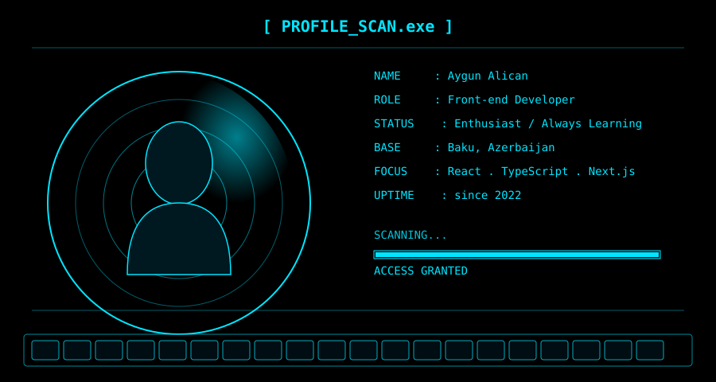

<table width="100%">
<tr>
<td align="center" style="background:#000000;" width="100%">

<h1><b>AYGUN ALICAN</b></h1>

enthusiast developer

</td>
</tr>
</table>

 

 

 <b>ABOUT</b> 

 

<table>
<tr>
<td width="130" align="center">

</td>
<td>

**Role** — Front-end developer, enthusiast  
**Study** — Final-year Computer Engineering, ASOIU x Siegen University  
**Focus** — React, TypeScript, exploring backend fundamentals  
**Goal** — Study abroad, bring the experience back home  

</td>
</tr>
</table>

 

 <b>STACK</b> 

 

  
  
  

  
  
  

  
  
  
  

 

 <b>STATS</b> 

 

 

 

 <b>PROJECTS</b> 

 

<table align="center">
<tr>
<td>

</td>
<td>

</td>
</tr>
<tr>
<td>

</td>
<td>

</td>
</tr>
</table>

 

 <b>GALLERY</b> 

 

  
  
  

 

 <b>CONTACT</b> 

 

  
  

 

